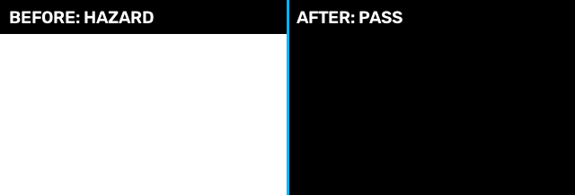

# FlashPatch

FlashPatch는 게임과 영상의 위험한 번쩍임을 발견에서 끝내지 않고, 수정하고 다시 검증해 증거까지 남기는 오픈소스 Visual Safety QA입니다.

**화면에서 위험을 찾고 → 가장 작은 수정을 적용하고 → 같은 조건으로 다시 실행하고 → 결과를 영수증으로 남깁니다.**

목차: [경쟁 제품과의 차이](#1-경쟁-제품과의-차이) · [실제 검증 결과](#2-실제-검증-결과) · [게임과 영상 제작](#3-게임과-영상-제작) · [엔진 지원 범위](#4-엔진-지원-범위) · [Godot 증명 실행](#5-godot-증명-실행) · [판정 체계](#6-판정-체계) · [작동 구조](#7-작동-구조) · [표준과 품질](#8-표준과-품질) · [라이선스](#9-라이선스) · [변경 이력](#10-변경-이력)



## 1 경쟁 제품과의 차이

기존 공개 도구는 색각 시뮬레이션, 위험 탐지, 영상 필터링처럼 한 단계에 강점이 있습니다. FlashPatch의 차이는 **위험 발견부터 수정, 동일 조건 재검증, 증거 발급까지 한 흐름으로 끝낸다**는 점입니다.

| 제품 | 가장 잘하는 일 | 입력 범위 | 위험 탐지 | 위험 수정 | 게임 원인 소스 연결 | 동일 플레이 회귀검사 | 해시 결박 영수증 |
|---|---|---|:---:|:---:|:---:|:---:|:---:|
| **FlashPatch** | **위험 발견 → 최소 수정 → 재검증** | **게임 프로젝트·렌더 캡처·MP4** | **✓** | **Godot 소스·MP4 국소 수선** | **Godot ✓** | **Godot ✓ · Unreal 통제 환경 ✓** | **✓** |
| [Ubisoft Chroma](https://github.com/ubisoft/Chroma) | 모든 게임 위에서 실시간 색각 이상 시뮬레이션 | 게임 화면 | 색각 문제 시각화 | — | — | — | — |
| [EA IRIS](https://github.com/electronicarts/IRIS) + [UE5 플러그인](https://github.com/electronicarts/IRIS-Unreal-Plugin) | 영상·UE5 실행 화면의 광과민성 위험 분석 | 영상·Unreal Engine 5 | ✓ | — | — | — | CSV·JSON 결과 |
| [FFmpeg photosensitivity](https://ffmpeg.org/ffmpeg-filters.html#photosensitivity) | 기존 영상 처리 파이프라인에 번쩍임 완화 필터 적용 | 영상 | 필터 내부 판정 | ✓ | — | — | — |
| [Apple VideoFlashingReduction](https://github.com/apple/VideoFlashingReduction) | 영상 번쩍임 위험 계산과 감소 알고리즘의 참조 구현 | 영상 | ✓ | ✓ | — | — | — |
| [EPI-LENS](https://github.com/Pi-0r-Tau/EPI-LENS) | 브라우저 실시간·오프라인 영상 분석과 지표 내보내기 | 웹·영상 | ✓ | — | — | — | JSON·NDJSON 결과 |

Ubisoft Chroma가 개발자가 색각 문제를 직접 보도록 돕는 도구라면, FlashPatch는 광과민성 위험을 측정하고 실제 수정이 게임을 망가뜨리지 않았는지까지 확인합니다. EA IRIS의 UE5 플러그인은 실행 중 위험 탐지와 사고 구간 기록에 강합니다. FlashPatch는 여기서 한 걸음 더 나아가 수정 전후의 인과관계와 회귀 결과를 하나의 검증 영수증으로 묶는 것을 목표로 합니다.

비교 기준은 2026-08-26 각 프로젝트의 공식 공개 문서입니다. 체크 표시는 공개 사용 경로에서 확인되는 기능만 뜻하며, 탐지 정확도의 보편적 순위를 의미하지 않습니다.

## 2 실제 검증 결과

체크인된 증명은 실제 Godot 4.7.1 X11/OpenGL 렌더링 결과입니다.

| 측정 항목 | 결과 |
|---|---:|
| 시각 위험 판정 | **FAIL → PASS** |
| 최대 측정 위험도 | **5.0 → 0.0** |
| 소스 수정 | `main.gd:3`, `burst_intensity 1.0 → 0.0` |
| 변경한 소스 할당문 | **1개** |
| 같은 조작 순서 재실행 | **보존** |
| 타이밍 | **보존** |
| 게임 상태 | **보존** |
| 의미 불변조건 | **보존** |
| 원본 프로젝트 | **변경 없음** |

[한 줄 소스 변경](proof/godot-demo/patch.diff)과 [공개 영수증](proof/godot-demo/receipt.json)을 직접 열어보거나 다음 명령으로 모든 산출물 해시를 다시 검증할 수 있습니다.

```bash
flashpatch verify-godot-demo proof/godot-demo/receipt.json
```

## 3 게임과 영상 제작

FlashPatch는 하나의 엔진 전용 도구가 아니라 두 가지 제작 흐름을 지원합니다.

### 3.1 게임 개발 흐름

| 단계 | FlashPatch가 하는 일 |
|---|---|
| 캡처 | 실제 렌더러의 RGB 프레임과 timestamp를 수집합니다. |
| 탐지 | 위험 구간, 영향 면적, 번쩍임 유형을 계산합니다. |
| 원인 연결 | runtime node, property, script, source line을 위험 프레임에 연결합니다. |
| 최소 수정 | 허용 목록에 있는 소스 할당문 하나만 격리된 복사본에서 바꿉니다. |
| 재실행 | 같은 action trace를 다시 재생합니다. |
| 보존 확인 | 타이밍, 게임 상태, 의미 불변조건을 비교합니다. |
| 증명 | 입력·수정·출력 해시와 최종 판정을 영수증으로 남깁니다. |

현재 공개 end-to-end 경로는 Godot입니다. Unreal Engine은 실제 렌더러를 사용한 통제 환경에서 수정 전후 보존 검사를 통과했습니다. Unity는 source preflight와 renderer 증거 검증 경로를 갖추고 있습니다.

### 3.2 영상 제작 흐름

예고편, 시네마틱, 광고, 뮤직비디오, 방송·스트리밍용 MP4도 검사하고 수선할 수 있습니다.

| 작업 | 결과물 |
|---|---|
| `scan` | 위험 구간, 번쩍임 종류, 영향 면적, 시공간 hazard mask |
| `repair` | 위험 영역만 국소 수선한 MP4와 변경 비율·입출력 해시 영수증 |
| `verify` | 별도 decoder로 다시 연 영상을 독립 판정한 결과 |
| 메타데이터 검사 | timestamp와 색상 메타데이터 보존 여부 |

```bash
flashpatch scan trailer.mp4 --mask artifacts/trailer-hazard-mask.npz
flashpatch repair trailer.mp4 trailer-safe.mp4 --receipt artifacts/trailer-repair.json
flashpatch verify trailer-safe.mp4
```

FlashPatch는 화면 전체를 흐리게 만드는 대신 측정된 위험의 시간·공간 범위에 수선을 집중합니다. 원본과 수선본의 해시, 바뀐 픽셀 비율, 독립 검증 결과가 영수증에 함께 기록되므로 영상 제작 QA와 납품 전 검수에 사용할 수 있습니다.

현재 CLI가 직접 처리하는 범위는 MP4의 시각 트랙입니다. 오디오·자막이 포함된 최종 납품본은 검증된 수선 영상에 원본 스트림을 후속 mux하는 방식으로 구성할 수 있습니다.

## 4 엔진 지원 범위

엔진 이름만 나열하지 않고 현재 확보된 가장 강한 증거 수준을 함께 표시합니다.

| 엔진 | 확인된 실행 경로 | 증거 수준 | 판정 |
|---|---|---|---:|
| **Godot 4.7.1** | 실제 renderer → source line → 소스 수정 1개 → same-trace replay | 공개 end-to-end | **`PASS`** |
| **Unreal Engine 5.6** | 실제 renderer → 통제된 runtime parameter 수정 → 보존 검사 | 통제 renderer | **`PASS`** |
| **Unity 2022.3.8f1** | manifest-bound source preflight + natural-project renderer 실행 | source preflight 완료, renderer 증거 미완료 | **`INCONCLUSIVE`** |

Unreal 결과에서는 action sequence, timing, object identity, terminal state, visual intent, gameplay state가 보존됐습니다. 현재 결과는 통제된 runtime parameter 검증이며 상용 프로젝트용 소스 수선 어댑터로 검증된 것은 아닙니다.

Unity 공개 명령은 editor import 전에 선언된 소스 파일을 manifest에 결박합니다. natural-project renderer 실행도 존재하지만 위험 제거, capture artifact 반복성, gameplay state 보존을 동시에 확립하지 못해 `INCONCLUSIVE`로 유지합니다.

```bash
flashpatch unity-preflight unity-source-manifest.json /path/to/UnityProject
```

외부 renderer capture도 엔진 identity나 source causality를 과장하지 않고 검사할 수 있습니다.

```bash
flashpatch renderer-intake capture.npz --receipt artifacts/capture-intake.json
```

엔진별 기계 판독 범위와 영수증 해시는 [proof/engine-coverage.json](proof/engine-coverage.json)에 있습니다.

## 5 Godot 증명 실행

Python 3.11 이상과 Godot 4가 필요합니다. 화면이 없는 Linux에서는 실제 renderer를 위해 `xvfb-run`을 사용합니다.

```bash
git clone https://github.com/sergiobuilds/flashpatch.git
cd flashpatch
python3 -m venv .venv
source .venv/bin/activate
python -m pip install .

export GODOT_BINARY=/path/to/godot
xvfb-run -a flashpatch godot-demo
flashpatch verify-godot-demo artifacts/godot-demo/receipt.json
```

데스크톱 환경에서는 `xvfb-run` 없이 `flashpatch godot-demo`를 실행하면 됩니다. 포함된 [interaction-burst 예제](examples/godot/interaction-burst/)를 실제로 렌더링하고, 원인을 찾고, 수정하고, 같은 플레이를 재실행해 전후 이미지·비교 이미지·source diff·engine receipt·공개 검증 영수증을 생성합니다.

네 가지 최종 판정을 빠르게 살펴보려면 다음 명령을 사용합니다.

```bash
flashpatch safety-demo --output artifacts/safety-demo
```

## 6 판정 체계

| 판정 | 의미 |
|---|---|
| `PASS` | 허용된 소스 수정 하나가 위험을 제거했고 replay 계약도 보존했습니다. |
| `SAFE` | 원본 replay가 이미 선언된 기준보다 안전했습니다. |
| `FAIL` | 위험이 남았거나 수정으로 게임의 선언된 불변조건이 깨졌습니다. |
| `INCONCLUSIVE` | 필요한 증거가 없거나, 모호하거나, 허용된 수정 범위를 벗어났습니다. |

누락된 renderer frame, 뒤집힌 timestamp, 모호한 source binding, 두 개 이상 parameter가 필요한 수정은 성공으로 추측하지 않습니다.

| 실패 반전 예제 | 반드시 나와야 하는 판정 |
|---|---:|
| 허용된 수정 뒤에도 위험이 남음 | `FAIL` |
| 위험은 사라졌지만 게임 상태가 달라짐 | `FAIL` |
| parameter 두 개를 함께 바꿔야 함 | `INCONCLUSIVE` |
| renderer timestamp가 없음 | `INCONCLUSIVE` |
| 처음부터 기준보다 안전함 | `SAFE` |

## 7 작동 구조

### 7.1 게임 프로젝트

```text
action trace + game project
            │
            ▼
  원본 replay ──► renderer RGB frame ──► 위험 구간
       │                                      │
       └──── runtime event ──► node / property / source line
                                              │
                                              ▼
                                   허용된 소스 수정 1개
                                              │
                                              ▼
                                      same-trace replay
                                              │
                                              ▼
                               위험 제거 + 게임 보존 + 영수증
```

원본 프로젝트는 실행 전후 해시를 비교합니다. 모든 수정은 격리된 복사본에서만 일어납니다. 실제 renderer pixel이 안전 기준을 통과하고 선언된 replay invariant가 원본과 일치할 때만 수정 후보를 채택합니다.

### 7.2 완성 영상

```text
MP4 ──► frame·timestamp 분석 ──► hazard mask ──► 국소 수선
 │                                                   │
 └──────────────── 원본 hash ───────────────────────┤
                                                     ▼
                                    독립 decoder 재검증 + 영수증
```

## 8 표준과 품질

탐지 경계는 [WCAG 2.2 번쩍임 기준](docs/research/2026-WCAG22-THRESHOLDS.md)에 문서화돼 있습니다. 기계 판독 경계 사례는 [standards-boundary-vectors.json](docs/research/standards-boundary-vectors.json)에 있습니다.

```bash
python -m pip install -e ".[dev]"
python -m pytest -q
python scripts/check_public_release.py
```

CI는 Linux·Windows·macOS에서 Python 3.11과 3.12를 검사합니다. Linux에서는 전체 공개 테스트와 Godot renderer 경로를 함께 실행합니다. wheel을 소스 checkout 밖에 설치한 뒤 CLI를 실행하며, 공개 경계 검사와 CycloneDX SBOM도 검증합니다.

보안 제보는 [SECURITY.md](SECURITY.md), 기여 방법은 [CONTRIBUTING.md](CONTRIBUTING.md)를 참고하십시오.

## 9 라이선스

FlashPatch는 [Apache License 2.0](LICENSE)으로 공개됩니다. 제3자 고지는 [NOTICE](NOTICE), CycloneDX 1.5 source SBOM은 [sbom/flashpatch.cdx.json](sbom/flashpatch.cdx.json)에 있습니다.

## 10 변경 이력

- 2026-08-26: 공개 경쟁 제품 비교표, 게임·영상 제작 이중 사용 경로, Godot·Unreal·Unity 증거 수준을 README 첫 화면에 통합했습니다.
- 2026-08-26: 실제 Godot renderer 증명과 독립 검증 가능한 artifact 묶음을 공개했습니다.
- 2026-08-25: 설치 패키지 검사, 공개 경계 검증, 공급망 metadata를 추가했습니다.
- 2026-08-24: engine-free 계약 demo와 renderer-backed evidence를 분리했습니다.
